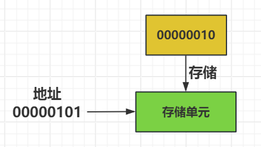

1.在计算机中数据都是按照二进制存储的，一个字节是8bit，在实际项目中，根据变量占用的内存大小,去查看原始数据,可以帮助查找错误。
附一张如何访问计算机中变量的图

2.首先要认识到c++是一个静态语言，也是一个强类型语言，不同于javascrepit对于类型的检查是很严格的。提到了类型那么就会延申到一个类型变量的声明和初始化。
延申知识点: std:: boolalpha 可以将true/flase输出至控制台上
3.目前作用域的概念以及理解的差不多了，对于存储区还要更深一步的了解。
1. **代码区（Code Segment/Text Segment）**：
    - 存储程序执行代码（即机器指令）的内存区域。这部分内存是共享的，只读的，且在程序执行期间不会改变。
    - 举例说明：当你编译一个C++程序时，所有的函数定义、控制结构等都会被转换成机器指令，并存储在代码区。
2. **全局/静态存储区（Global/Static Storage Area）**：
    - 存储全局变量和静态变量的内存区域。这些变量在程序的整个运行期间都存在，但它们的可见性和生命周期取决于声明它们的作用域。
    - 举例说明：全局变量（在函数外部声明的变量）和静态变量（使用`static`关键字声明的变量，无论是在函数内部还是外部）都会存储在这个区域。
3. **栈区（Stack Segment）**：
    - 存储局部变量、函数参数、返回地址等的内存区域。栈是一种后进先出（LIFO）的数据结构，用于存储函数调用和自动变量。
    - 举例说明：在函数内部声明的变量（不包括静态变量）通常存储在栈上。当函数被调用时，其参数和局部变量会被推入栈中；当函数返回时，这些变量会从栈中弹出，其占用的内存也随之释放。
4. **堆区（Heap Segment）**：
    - 由程序员通过动态内存分配函数（如`new`和`malloc`）分配的内存区域。堆区的内存分配和释放是手动的，因此程序员需要负责管理内存，以避免内存泄漏或野指针等问题。
    - 举例说明：当你使用`new`操作符在C++中动态分配一个对象或数组时，分配的内存就来自堆区。同样，使用`delete`操作符可以释放堆区中的内存。
5. **常量区（Constant Area）**：
    - 存储常量（如字符串常量、const修饰的全局变量等）的内存区域。这部分内存也是只读的，且通常在程序执行期间不会改变。
    - 举例说明：在C++中，使用双引号括起来的字符串字面量通常存储在常量区。此外，使用`const`关键字声明的全局变量，如果其值在编译时就已确定，也可能存储在常量区。